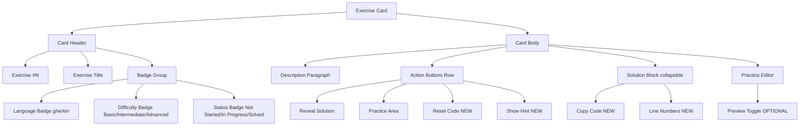
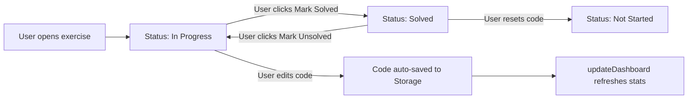

# Coding Exercises Enhancement Plan

## Current State Summary

The app has **24 hand-crafted coding exercises** across 4 languages (gherkin, java, javascript, yaml) extracted in [`app/js/parser.js`](app/js/parser.js:166) via `extractExercises()`. 

### Existing Features
| Feature | Implementation |
|---|---|
| Language filter chips | `renderFilterChips('coding')` in [`app/js/main.js`](app/js/main.js:93) |
| Text search across exercises | `handleSearch()` in [`app/js/main.js`](app/js/main.js:58) |
| Reveal/Hide solution toggle | `revealSolution()` in [`app/js/renderers.js`](app/js/renderers.js:247) |
| Practice textarea with auto-save | 500ms debounced save to `localStorage` in [`app/js/renderers.js`](app/js/renderers.js:212) |
| Tab-key indentation in textarea | Keydown listener in [`app/js/renderers.js`](app/js/renderers.js:218) |
| Save status indicator | "Saving..." / "Saved ✅" in [`app/js/renderers.js`](app/js/renderers.js:238) |
| Attempted count in dashboard | `updateDashboard()` in [`app/js/main.js`](app/js/main.js:202) |
| Export/Import progress backup | `exportProgress()` / `importProgress()` in [`app/js/main.js`](app/js/main.js:238) |

### Current Gaps
1. **No difficulty level** — exercises range from basic (GET request) to advanced (schema validation), but no visual indicator
2. **No "Mark as Solved"** — only tracks if user opened editor (has saved code), not whether they solved it
3. **No code reset** — user cannot reset their practice code to the original solution
4. **No copy-to-clipboard** on solution code blocks
5. **No progressive hints** — only binary show/hide solution
6. **No per-exercise status badge** (Not Started / In Progress / Completed)
7. **No difficulty progress bar** in dashboard
8. **No line numbers** on solution code blocks
9. **No syntax highlighting in the editor textarea** — textarea is plain monospace only
10. **Underutilized auto-extracted code blocks** — regex in `extractExercises()` already captures all code blocks from markdown but they're discarded

---

## Enhancement Areas (Prioritized)

### 1. Exercise Completion Tracking (Mark as Solved)

**Files to modify:** [`app/js/renderers.js`](app/js/renderers.js), [`app/js/main.js`](app/js/main.js), [`app/js/storage.js`](app/js/storage.js)

- Add a new `Storage` key: `karateLab.exercise_status` (JSON map: `{ "1": "solved", "2": "in_progress", ... }`)
- Add a **"Mark as Solved"** button → green checkmark, persists status
- Add a **"Mark as Unsolved"** (undo) button for completed exercises
- Update `exercise_status` in `updateDashboard()` to show `Solved: X / 24` instead of just `Attempted: X / 24`
- Show a **status badge** on each exercise card header: 🔴 Not Started / 🟡 In Progress / 🟢 Solved

### 2. Difficulty Level Badges & Grouping

**Files to modify:** [`app/js/parser.js`](app/js/parser.js), [`app/js/renderers.js`](app/js/renderers.js), [`app/js/main.js`](app/js/main.js), [`app/css/main.css`](app/css/main.css)

- Add a `difficulty` field to each exercise in `extractExercises()`:
  - **Basic** (ex #17-20): Simple GET, variables, POST, path/params
  - **Intermediate** (ex #1-16): CRUD, runners, config, mocks, benchmarks, data-driven
  - **Advanced** (ex #21-24): Array operations, response time assertions, XML strings, schema validation
- Add a **difficulty pill badge** (green=Basic, amber=Intermediate, red=Advanced) next to the language badge
- Add **section headers** grouping exercises: "Basic", "Intermediate", "Advanced"
- Add difficulty filter chips alongside language chips

### 3. Code Reset Button

**Files to modify:** [`app/js/renderers.js`](app/js/renderers.js), [`app/css/main.css`](app/css/main.css)

- Add a **"Reset Code"** button (with confirmation dialog) in the exercise actions area
- On click, clear the saved code from `Storage`, reset textarea to placeholder, show confirmation toast
- Delete `karateLab.exercise_{id}` key from Storage

### 4. Copy-to-Clipboard for Solution Code

**Files to modify:** [`app/js/renderers.js`](app/js/renderers.js), [`app/css/main.css`](app/css/main.css)

- Add a **copy button** (📋 icon) in the top-right corner of the solution `<pre>` block
- On click: `navigator.clipboard.writeText(code)`, show brief "Copied!" feedback (CSS tooltip/popover)
- Hide copy button when solution is collapsed

### 5. Progressive Hint System

**Files to modify:** [`app/js/renderers.js`](app/js/renderers.js), [`app/js/parser.js`](app/js/parser.js), [`app/css/main.css`](app/css/main.css)

- Add an optional `hints` array field to each exercise object
- Render as a **"Show Hint"** button that cycles through hints progressively
- Example hints for ex #1 (CRUD): 
  - Hint 1: "Start by defining a unique pet ID using `call uniqueId`"
  - Hint 2: "Use `call read('...@createPet')` to create the pet with a payload"
  - Hint 3: "After creating, use `Given path 'pet', petId` then `When method get`"
- Implement as a cycle: Show Hint → Hint 1 → Hint 2 → Hint 3 → (back to Show Hint)
- Style hints as info boxes with a lightbulb icon

### 6. Enhanced Dashboard Stats for Exercises

**Files to modify:** [`app/js/main.js`](app/js/main.js), [`app/index.html`](app/index.html), [`app/css/main.css`](app/css/main.css)

- Break exercise stats into:
  - Total exercises: `24`
  - Solved: `X / 24` (from `exercise_status`)
  - In Progress: `Y / 24`
  - By difficulty: Basic `X/4`, Intermediate `Y/16`, Advanced `Z/4`
- Add a secondary stats row or tooltip popover

### 7. Line Numbers on Solution Code Blocks

**Files to modify:** [`app/js/renderers.js`](app/js/renderers.js), [`app/css/main.css`](app/css/main.css)

- Wrap solution `<pre>` blocks with a line-number column using CSS `counter` + `::before` pseudo-elements
- Style: muted gray numbers, right-aligned, `user-select: none`

### 8. (Optional) Syntax-Highlighted Editor Preview

**Files to modify:** [`app/js/renderers.js`](app/js/renderers.js), [`app/css/main.css`](app/css/main.css)

- Add a **"Preview"** toggle above the textarea that renders the current textarea content into a Prism-highlighted `<pre>` block
- Sync between editable textarea and read-only highlighted preview
- Complex interaction: keep textarea hidden when preview is active, show a "Edit" button to switch back

---

## Implementation Order

### Phase 1 — Core UX Improvements (High Impact, Low Risk)
1. **Difficulty badges + grouping** — visual organization
2. **Exercise completion tracking** — mark as solved/unsolved
3. **Code reset button** — user control
4. **Copy-to-clipboard** — productivity

### Phase 2 — Enhanced Learning (Medium Impact)
5. **Hint system** — progressive learning aid
6. **Line numbers** — code readability
7. **Enhanced dashboard stats** — better progress visibility

### Phase 3 — Advanced (Optional)
8. **Syntax-highlighted editor preview** — complex interaction

---

## Files to Modify

| File | Changes |
|---|---|
| [`app/js/parser.js`](app/js/parser.js) | Add `difficulty` field to each exercise; add optional `hints[]` array |
| [`app/js/renderers.js`](app/js/renderers.js) | Update `renderExercises()` with new UI elements; add hint, reset, copy, status functions |
| [`app/js/main.js`](app/js/main.js) | Update `updateDashboard()` with solved/in-progress/difficulty stats; update filter chips for difficulty |
| [`app/css/main.css`](app/css/main.css) | Add styles for difficulty badges, status badges, hints, line numbers, copy button, reset button |
| [`app/js/storage.js`](app/js/storage.js) | (No changes needed — generic `get`/`set` already supports new keys) |
| [`app/index.html`](app/index.html) | (Minimal changes — possibly add dashboard stat containers) |

---

## Data Model Changes

### New Storage Keys
```
karateLab.exercise_status  => { "1": "solved", "2": "in_progress", ... }
karateLab.exercise_{id}    => (already exists — user's code)
```

### Enhanced Exercise Object
```javascript
{
  id: 1,
  title: 'E2E CRUD Scenario',
  lang: 'gherkin',
  difficulty: 'intermediate',    // NEW
  hints: ['Hint 1...', '...'],   // NEW
  code: '...',
  description: '...',
  setup: '...'
}
```

### Difficulty Mapping
| IDs | Difficulty | Color |
|---|---|---|
| 17, 18, 19, 20 | Basic | 🟢 Green |
| 1, 2, 3, 4, 5, 6, 7, 8, 9, 10, 11, 12, 13, 14, 15, 16 | Intermediate | 🟡 Amber |
| 21, 22, 23, 24 | Advanced | 🔴 Red |

---

## Mermaid Diagram — Enhanced Exercise Card Layout



## Progress Tracking Flow



---

## Acceptance Criteria

After implementation, the coding exercises section should:

- [ ] Show difficulty badges (Basic/Intermediate/Advanced) on each exercise card
- [ ] Group exercises under difficulty section headers
- [ ] Allow users to mark exercises as solved/unsolved with persisted status
- [ ] Show per-exercise status badge (Not Started / In Progress / Solved)
- [ ] Provide a Reset Code button that clears the user's practice code
- [ ] Provide a Copy button on solution code blocks
- [ ] Show progressive hints (if defined for the exercise)
- [ ] Show difficulty-filtered progress in the dashboard
- [ ] Display line numbers on solution code blocks
- [ ] (Optional) Provide syntax-highlighted preview of practice code
