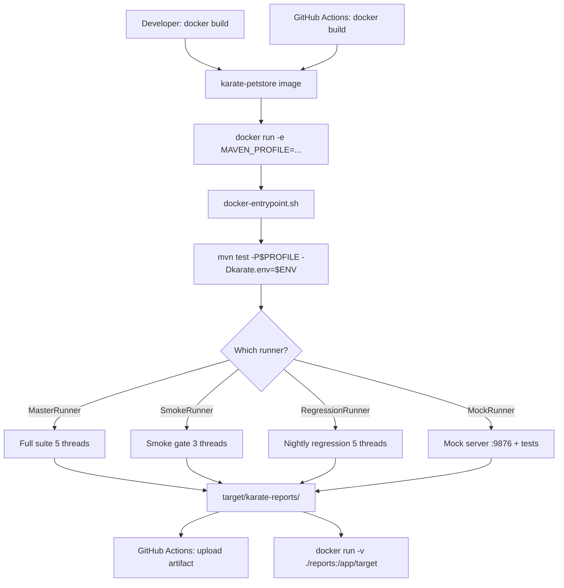

# Docker Containerization Plan — Karate Petstore Test Suite

## 1. Overview

Wrap the entire Karate test suite (including the in-process mock server) inside a Docker image. This guarantees bit-for-bit identical test execution across developer machines, CI runners (GitHub Actions), and any other target environment — eliminating "works on my machine" failures.

### Goals

- **Portable execution** — single `docker run` command runs any Maven profile
- **CI-ready** — image pushes to GitHub Container Registry (GHCR), consumed by GitHub Actions
- **Mock server included** — the [`MockRunner`](../src/test/java/petstore/runners/MockRunner.java) starts Karate's Netty mock server in-process; the image handles this transparently
- **No network dependency** — offline mock profile works inside the container without internet (beyond the initial `mvn dependency:resolve`)
- **Report extraction** — test reports written to a mounted volume or `docker cp`

---

## 2. File Changes

| File | Action | Description |
|------|--------|-------------|
| `Dockerfile` | **Create** | Multi-stage build: Maven + JDK 17 stage → slim JRE runtime stage |
| `.dockerignore` | **Create** | Exclude `target/`, `.git/`, `node_modules/`, local IDE files |
| `.github/workflows/test.yml` | **Create** | GitHub Actions workflow: build image, run tests, publish report |
| `.github/workflows/docker-publish.yml` | **Create** | Automatic image build & push to GHCR on `main` branch pushes |

---

## 3. Dockerfile Design

### Strategy: Multi-stage Build

```
Stage 1 (builder):  maven:3.9-eclipse-temurin-17
  ├── Copy pom.xml + src/
  ├── RUN mvn dependency:resolve   (cache layer)
  ├── RUN mvn package -DskipTests  (compiled JARs)
  └── Copy target/ to /app/artifacts/

Stage 2 (runtime):  eclipse-temurin:17-jre-alpine
  ├── Install Maven (small ~20MB)
  ├── COPY --from=builder /app/artifacts /app
  ├── COPY --from=builder /root/.m2 /root/.m2
  ├── ENTRYPOINT ["mvn", "test"]
  └── CMD (default profile = MasterRunner)
```

### Why Alpine JRE + Maven instead of fat `maven:3.9` image

| Metric | `maven:3.9-eclipse-temurin-17` | `eclipse-temurin:17-jre-alpine` + Maven |
|--------|--------------------------------|----------------------------------------|
| Image size | ~650 MB | ~220 MB |
| Includes compiler | Yes (unnecessary at runtime) | No (JRE only) |
| Dependency resolution | Already cached from builder | Inherited from builder layer |

### Port Mapping

| Port | Purpose |
|------|---------|
| `9876` | Mock server (used by [`MockRunner.java`](../src/test/java/petstore/runners/MockRunner.java)) |

### Environment Variables

| Variable | Default | Purpose |
|----------|---------|---------|
| `KARATE_ENV` | `dev` | Active environment (`dev`, `qa`, `staging`) |
| `MAVEN_PROFILE` | (empty = MasterRunner) | Maven profile: `smoke`, `regression`, `mock`, `performance` |
| `KARATE_OPTIONS` | (empty) | Extra Karate CLI options: `--tags @smoke` |
| `REPORT_DIR` | `/app/target` | Output directory for HTML/JSON reports |

---

## 4. Dockerfile Content

```dockerfile
# =============================================================================
# Stage 1 — Build dependencies & compile
# =============================================================================
FROM maven:3.9-eclipse-temurin-17 AS builder

WORKDIR /build

# 1. Copy pom.xml and resolve dependencies (layer caching)
COPY pom.xml .
RUN mvn dependency:resolve -q

# 2. Copy source and compile
COPY src src
RUN mvn package -DskipTests -q

# 3. Collect compiled artifacts + Maven cache for reuse
RUN mkdir -p /app/artifacts && \
    cp -r target /app/artifacts/target

# =============================================================================
# Stage 2 — Slim runtime image
# =============================================================================
FROM eclipse-temurin:17-jre-alpine

# Install Maven (lightweight — Alpine package ~18 MB)
RUN apk add --no-cache maven

WORKDIR /app

# Copy Maven cache and compiled artifacts from builder
COPY --from=builder /root/.m2 /root/.m2
COPY --from=builder /build/pom.xml .
COPY --from=builder /build/src src

# Default environment
ENV KARATE_ENV=dev
ENV MAVEN_PROFILE=
ENV KARATE_OPTIONS=
ENV REPORT_DIR=/app/target

# Expose mock server port (used by MockRunner)
EXPOSE 9876

# Copy entrypoint script
COPY docker-entrypoint.sh /usr/local/bin/
RUN chmod +x /usr/local/bin/docker-entrypoint.sh

ENTRYPOINT ["docker-entrypoint.sh"]
```

---

## 5. Entrypoint Script

```bash
#!/bin/sh
# docker-entrypoint.sh
set -e

# Build Maven command
CMD="mvn test"

# Append profile if set
if [ -n "$MAVEN_PROFILE" ]; then
    CMD="$CMD -P$MAVEN_PROFILE"
fi

# Append environment
CMD="$CMD -Dkarate.env=$KARATE_ENV"

# Append extra options
if [ -n "$KARATE_OPTIONS" ]; then
    # Support both --tags and -Dkarate.options= format
    echo "$KARATE_OPTIONS" | grep -q '^-D' && \
        CMD="$CMD $KARATE_OPTIONS" || \
        CMD="$CMD -Dkarate.options=\"$KARATE_OPTIONS\""
fi

echo "[entrypoint] Running: $CMD"
exec $CMD
```

---

## 6. Usage Examples

```bash
# Build the image
docker build -t karate-petstore .

# ── Default: run MasterRunner against dev ──────────────
docker run --rm karate-petstore

# ── Mock profile (offline, no network needed) ──────────
docker run --rm -e MAVEN_PROFILE=mock karate-petstore

# ── Smoke tests against QA environment ─────────────────
docker run --rm \
    -e MAVEN_PROFILE=smoke \
    -e KARATE_ENV=qa \
    karate-petstore

# ── Regression with custom tags ─────────────────────────
docker run --rm \
    -e MAVEN_PROFILE=regression \
    -e KARATE_OPTIONS="--tags @performance" \
    karate-petstore

# ── Extract reports to host machine ─────────────────────
docker run --rm -v $(pwd)/reports:/app/target karate-petstore
ls ./reports/karate-reports/
```

---

## 7. `.dockerignore`

```gitignore
# Build artefacts
target/
!.mvn

# Version control
.git/
.gitignore

# IDE
.vscode/
.idea/
*.iml

# OS
.DS_Store
Thumbs.db

# Node / app UI (not needed in test runner image)
node_modules/
app/
```

---

## 8. GitHub Actions Workflow

### 8.1 Test Workflow — `.github/workflows/test.yml`

```yaml
name: Karate Tests

on:
  push:
    branches: [main, develop]
  pull_request:
    branches: [main]

jobs:
  test:
    runs-on: ubuntu-latest
    steps:
      - name: Checkout
        uses: actions/checkout@v4

      - name: Build Docker image
        run: docker build -t karate-petstore .

      - name: Run Mock Profile (offline smoke gate)
        run: |
          docker run --rm \
            -e MAVEN_PROFILE=mock \
            -e KARATE_ENV=dev \
            -v ${{ github.workspace }}/reports:/app/target \
            karate-petstore

      - name: Upload Test Reports
        if: always()
        uses: actions/upload-artifact@v4
        with:
          name: karate-reports
          path: reports/
```

### 8.2 Docker Publish — `.github/workflows/docker-publish.yml`

```yaml
name: Publish Docker Image

on:
  push:
    branches: [main]
    tags: ['v*']

env:
  REGISTRY: ghcr.io
  IMAGE_NAME: ${{ github.repository }}

jobs:
  build-and-push:
    runs-on: ubuntu-latest
    permissions:
      contents: read
      packages: write

    steps:
      - name: Checkout
        uses: actions/checkout@v4

      - name: Log in to GHCR
        uses: docker/login-action@v3
        with:
          registry: ${{ env.REGISTRY }}
          username: ${{ github.actor }}
          password: ${{ secrets.GITHUB_TOKEN }}

      - name: Extract metadata
        id: meta
        uses: docker/metadata-action@v5
        with:
          images: ${{ env.REGISTRY }}/${{ env.IMAGE_NAME }}

      - name: Build and push
        uses: docker/build-push-action@v5
        with:
          context: .
          push: true
          tags: ${{ steps.meta.outputs.tags }}
          labels: ${{ steps.meta.outputs.labels }}
```

---

## 9. Execution Flow Diagram



---

## 10. Potential Concerns & Mitigations

| Concern | Mitigation |
|---------|------------|
| **Large image size** (~220 MB runtime) | Acceptable for CI; could use `distroless` base (further reduce to ~180 MB) but Alpine is easier to debug |
| **Maven in Alpine** | Official Alpine package works; tested with Java 17 |
| **Dependency cache invalidation** | `pom.xml` change invalidates `dependency:resolve` layer; intentional — ensures fresh deps |
| **MockRunner port conflict** | Container runs in isolated network namespace; port 9876 is internal only |
| **Report extraction on Windows** | Windows users should use `docker run -v %cd%/reports:/app/target` (PowerShell) or WSL |
| **API rate limiting** | Tests call `petstore.swagger.io`; mock profile bypasses this entirely |

---

## 11. Implementation Order

1. Create [`Dockerfile`](../Dockerfile)
2. Create [`.dockerignore`](../.dockerignore) (project root)
3. Create [`docker-entrypoint.sh`](../docker-entrypoint.sh)
4. Create `.github/workflows/test.yml`
5. Create `.github/workflows/docker-publish.yml`
6. Build and verify locally: `docker build -t karate-petstore . && docker run --rm -e MAVEN_PROFILE=mock karate-petstore`
7. Push to GitHub and verify CI runs

---

## 12. Files Summary

| # | File | Lines | Type |
|---|------|-------|------|
| 1 | `Dockerfile` | ~50 | Multi-stage Docker build |
| 2 | `.dockerignore` | ~15 | Build context exclusions |
| 3 | `docker-entrypoint.sh` | ~25 | Shell entrypoint script |
| 4 | `.github/workflows/test.yml` | ~35 | CI test workflow |
| 5 | `.github/workflows/docker-publish.yml` | ~40 | Docker publish workflow |
